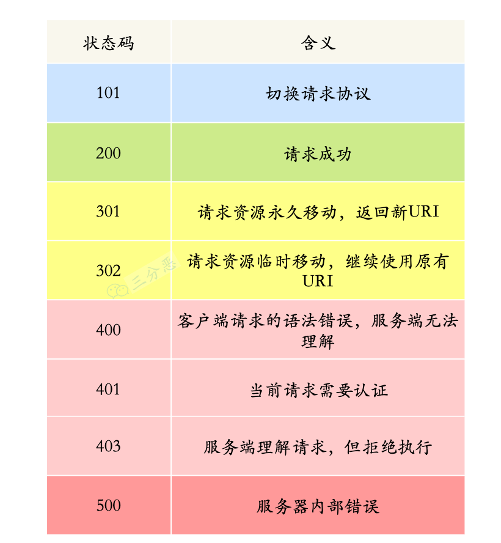

## 项目

在素材管理系统中设计并实现了流程审批系统，角色权限管理系统，素材编辑系统，~~公司首个nodejs接入etcd~~

流程审批：由后台管理系统维护流程，通过编辑流程图，实现在不同阶段由不同角色进行审核，并且可以设置需要全部审核通过，还是单个审核通过，后台实现方式为栈，当有一个审批流程时，基于当前审批流程图数据创建一个审批堆栈，满足条件则推出顶层，进入下一层，一直到栈清空

角色权限管理：后台管理系统有角色管理和权限管理两个菜单，在角色管理中可以创建角色，为角色选择权限，配置角色用户，一个用户可以拥有多角色，在用户登录后，后台对用户所在角色权限进行合并，去重，然后返回给前端，前端通过vue directive控制对应状态

素材编辑：类富文本编辑，不过不需要加粗，斜体等等，仅是在设置 `contenteditable` 的基础上，增加了评论功能，评论功能的实现方式为在评论开始和结束的元素上进行拆分，将本来是一个tag的标签，根据用户选择范围，设置class，class格式为 `评论id + comment` ,然后监听这些元素的click事件，在点击时显示对应评论

~~接入etcd：作为第一个吃螃蟹的人，其实也是踩了不少坑，最开始，我是通过etcd这个包来进行etcd链接，需要自己管理etcd注册，更新，监听etcd事件，但是在一些实例销毁或创建时，总是没有监听到对应的事件，导致调用时发现实例不存在，然后基于这个问题，先是做了简单的定时轮询，每五分钟就全量更新一次etcd注册服务信息，但是还是会偶尔出问题，为了彻底解决这个问题，我仔细研究了etcd源码，并且修改源码，在里面设置断点等方式，也是发现事件未监听到，最后是通过~~

动态form表单，可以设置表单项隐藏，并且在隐藏时自动删除该项的值，为了实现表单隐藏保存，需要将表单id，isShow等信息存储到localstorage中，这就会导致新增的表单项默认是隐藏的，所以加了一个兼容，在判断到localstorage没有这一项时，以当前配置的isshow为准，实现了入dataPick等有多个值的表单项，可以设置不同的key，动态表单这个组件，已在超过十个项目中获得使用

排障系统：基于g6vp组件，进行二次开发

## 排序算法

排序算法： 常见的排序算法包括冒泡排序、选择排序、插入排序、归并排序、快速排序、堆排序等。

优缺点和适用场合：

冒泡排序：简单易懂，但效率较低，适合于少量元素的排序。 最坏 O(n^2) 最好 O(n)(加标志位)
选择排序：简单直观，但时间复杂度较高，适合于简单的排序任务。 (交换次数最少)
插入排序：对于部分有序的数据效率较高，适合于小规模数据或部分有序的数据。
归并排序：稳定且效率较高，适合处理大规模数据的排序。
快速排序：效率较高，但在最坏情况下可能性能下降，适合处理大规模数据的排序。
堆排序：空间复杂度低，适合处理大规模数据的排序。

### 冒泡排序

冒泡排序算法的运作如下：

1. 比较两个相邻的数，如果前面的数大于后面的数，则将这两个数交换位置。第一次遍历后，最大的数会被放到数组的最后位置，即array[length - 1]。
2. 第二次遍历时跳过最后一个元素，因为该元素通过第一次遍历已经确定是最大值。
3. 持续每次对越来越少的元素重复上面的步骤，直到没有任何一对数字需要比较。

```javascript
function bubbleSort = (array) => {
  let swapped = false
  let n = array.length - 1
  do {
    for (let i = 0; i < n; i++) {
      if (array[i] > array[i + 1]) {
        const temp = array[i]
        array[i] = array[i + 1]
        array[i + 1] = temp
        swapped = true
      }
    }
  } while (swapped)

  return array
}
```

```javascript
function bubbleSort (array) {
  for (let i = 0; i < array.length - 1; i++) {
    let swapped = false
    for(let j = 0; j< array.length - 1; j++) {
      if (array[i] > array[i + 1]) {
        let temp = array[i]
        array[i] = array[i + 1]
        array[i + 1] = temp
        swapped = true
      }
    }
    if (!swapped) break;
  }
  return array
}

```

时间复杂度 O(n^2)

### 选择排序

选择排序(Selection sort)是一种简单直观的排序算法。其基本思想是：首先在未排序的数列中找到最小(or最大)元素，然后将其存放到数列的起始位置；接着，再从剩余未排序的元素中继续寻找最小(or最大)元素，然后放到已排序序列的末尾。以此类推，直到所有元素均排序完毕。

```javascript
function selectSort (array) {
  let n = array.length
  for (let i = 0; i< n; i++) {
    let minIndex = i // 最小值下标
    for (j = i + 1; j < n; j++) {
      if (array[j] < array[minIndex]) {
        minIndex = j
      }
    }
    if (minIndex !== i) {
      let temp = array[i]
      array[i] = array[minIndex]
      array[minIndex] = temp
    }
  }
  return array
}

```

### 插入排序

插入排序的工作原理是通过构建有序序列，对于未排序数据，在已排序序列中从后向前扫描，找到相应位置并插入。插入排序在实现上，通常采用in-place排序（即只需用到O(1)的额外空间的排序），因而在从后向前扫描过程中，需要反复把已排序元素逐步向后挪位，为最新元素提供插入空间。


```javascript
function InsertSort (array) {
  for (let i = 1; i < array.length; i++) {
    let current = array[i]
    let j = i - 1
    while(j >= 0 && array[j] > current) {
      arr[j + 1] = arr[j]
      j--
    }
    array[j + 1] = current
  }
}
```

当时时间复杂度为O(n^2)

可采用二分法优化性能

```javascript
function InsertSort (array) {
  for (let i = 1; i < array.length; i++) {
    let left = 0
    let right = i - 1
    let current = array[i]
    let middle
    while (left <= right) {
      middle = Math.floor((left + right) / 2)
      if (array[middle] > current) {
        right = middle - 1
      } else {
        left = middle + 1
      }
    }
    for (let j = i -1; j>=left; j--) {
      array[j + 1] = array[j]
    }
    array[left] = current
  }
}

```

### 归并排序

归并排序（MERGE-SORT）是利用归并的思想实现的排序方法，该算法采用经典的分治（divide-and-conquer）策略（分治法将问题分(divide)成一些小的问题然后递归求解，而治(conquer)的阶段则将分的阶段得到的各答案"修补"在一起，即分而治之)。

```javascript
function mergeSort (arr) {
  if (arr.length <= 1) {
    return arr
  }
  const mid = Math.floor(arr.length / 2)
  const leftArr = arr.slice(0, mid)
  const rightArr = arr.slice(mid)
  const sortedLeft = mergeSort(leftArr)
  const sortedRight = mergeSort(rightArr)
  return merge(sortedLeft, sortedRight)
}

function merge (left, right) {
  let mergeArr = []
  let leftIndex = 0
  let rightIndex = 0
  while (leftIndex < left.length && rightIndex < right.length) {
    if (left[leftIndex] < right[rightIndex]) {
      mergeArr.push(left[leftIndex])
      leftIndex++
    } else {
      mergeArr.push(right[rightIndex])
      rightIndex++
    }
  }
  if (leftIndex < left.length) {
    mergeArr = mergeArr.concat(left.slice(leftIndex))
  }
   if (rightIndex < right.length) {
    mergeArr = mergeArr.concat(right.slice(rightIndex))
  }
  return mergeArr
}

```

### 快速排序

快速排序的3个基本步骤：

1. 从数组中选择一个元素作为基准点
2. 排序数组，所有比基准值小的元素摆放在左边，而大于基准值的摆放在右边。每次分割结束以后基准值会插入到中间去。
3. 最后利用递归，将摆放在左边的数组和右边的数组在进行一次上述的1和2操作。

```javascript
function quickSort (arr, startIndex, endIndex) {
  startIndex = startIndex ?? 0
  endIndex = endIndex ?? arr.length
  if (startIndex < endIndex - 1) {
    const mid = partition(arr, startIndex. endIndex)
    quickSort(arr, startIndex, mid - 1)
    quickSort(arr, mid + 1, end)
  }
  return arr
}

function partition (arr, startIndex, endIndex) {
  const pivot = arr[startIndex]
  let left = startIndex + 1
  let right = endIndex
  while (left < right) {
    while (left < right && arr[left] <= pivot) {
      left++
    }
    while(left < right && arr[right] >= pivot) {
      right--
    }
    if (left < right) {
      swap(arr, left, right)
      left++
      right--
    }
  }
  if (left === right && arr[right] > pivot) {
    right--
  }
  if (right !== startIndex) {
    swap(arr, startIndex, right)
  }
  return right
}

function swap (arr, i, j) {
 const t = arr[i]
 arr[i] = arr[j]
 arr[j] = t
} 
```

### 堆排序

```javascript

function heapSort (arr) {
  const len = arr.length
  // 构建最大堆
  for (let i = Math.floor(len / 2) - 1; i >= 0; i--) {
    heapify(arr, len, i)
  }
  // 依次去除堆顶元素并调整堆
  for (let i = len - 1; i > 0; i++) {
    swap(arr, 0, i)
  }
  return arr
}

function heapify (arr, len, index) {
  let maxIndex = index // 最大值索引
  const left = 2 * index + 1 // 左子节点索引
  const right = 2 * index + 2 // 右子节点索引
  if (left < len && arr[left] > arr[maxINdex]) {
    maxIndex = left
  }
  if (right < len && arr[right] > arr[maxIndex] {
    maxIndex = right
  })
  if (maxIndex !== index) {
    swap(arr, maxIndex, index)
    heapify(arr, len, maxIndex)
  }
}

function swap (arr, i, j) {
  const t = arr[i]
  arr[i] = arr[j]
  arr[j] = t
}

```

## 深克隆

第一种，json序列化 一般来说项目中使用可以

```javascript
function deepClone (obj) {
  return JSON.parse(JSON.stringify(obj))
}
```

第二种，对原始值和function直接赋值，对对象进行递归深克隆

```javascript
function deepClone (obj) {
  if (obj === null || typeof obj !== 'object') {
    return obj
  }
  const newObj = Array.isArray(obj) ? [] : {}
  for (let key in obj) {
    if (obj.hasOwnProperty(key)) {
      newObj[key] = deepClone(obj[key])
    }
  }
  return newObj
}

```

第三种方式 第三方库 比如lodash

## 三个数的最大乘积

并查集

```javascript
var maximumProduct = function(nums) {
  let [max1, max2, max3] = [-Infinity, -Infinity, -Infinity];
  let [min1, min2] = [Infinity, Infinity];
  for (const num of nums) {
    if (num < min1) {
      [min2, min1] = [min1, num];
    } else if (num < min2) {
      min2 = num;
    }
    if (num > max1) {
      [max3, max2, max1] = [max2, max1, num];
    } else if (num > max2) {
      [max3, max2] = [max2, num];
    } else if (num > max3) {
      max3 = num;
    }
  }
  return Math.max(min1 * min2 * max1, max1 * max2 * max3);
};

```

sort 排序

```javascript
var maximumProduct = function(nums) {
    nums.sort((a, b) => a - b);
    const n = nums.length;
    return Math.max(nums[0] * nums[1] * nums[n - 1], nums[n - 1] * nums[n - 2] * nums[n - 3]);
};
```

## webwork的考点和回答

Web Workers 是前端开发中的重要概念，掌握相关知识可以展示你对于 JavaScript 并发编程和性能优化的理解。以下是关于 Web Workers 的常见考点以及相应的回答：

1. **基本概念：**

   - **考点：** 了解 Web Workers 是 HTML5 中的一项技术，允许在浏览器中创建后台线程以执行耗时任务。
   - **回答：** Web Workers 允许在浏览器中创建多个 JavaScript 后台线程，使得可以在不阻塞主线程的情况下执行一些耗时的任务，例如大量计算、数据处理、网络请求等。
2. **使用方法：**

   - **考点：** 理解如何创建和使用 Web Workers。
   - **回答：** 使用 `new Worker('worker.js')` 可以创建一个 Web Worker，指定 worker 脚本的 URL。通过监听主线程和 Worker 之间的消息传递，可以实现数据的双向通信。
3. **线程间通信：**

   - **考点：** 了解如何在主线程和 Web Worker 之间进行通信。
   - **回答：** 可以通过 `postMessage()` 和 `onmessage` 方法实现主线程和 Worker 之间的消息传递。主线程通过 `worker.postMessage(data)` 发送消息，Worker 通过 `self.onmessage = function(event) { /* 处理消息 */ }` 接收消息，反之亦然。
4. **限制和注意事项：**

   - **考点：** 了解 Web Workers 的一些限制和注意事项。
   - **回答：** Web Workers 无法访问 DOM，因为它们运行在与主线程不同的上下文中。此外，由于安全性原因，Web Workers 无法访问某些浏览器 API（如 localStorage），并且受到跨域限制。
5. **浏览器支持和兼容性：**

   - **考点：** 了解不同浏览器对于 Web Workers 的支持情况。
   - **回答：** 大多数现代浏览器都支持 Web Workers，包括 Chrome、Firefox、Safari 和 Edge 等主流浏览器，但在一些旧版本浏览器（如 IE10 及以下版本）中可能存在兼容性问题。
6. **应用场景：**

   - **考点：** 理解 Web Workers 的应用场景。
   - **回答：** Web Workers 适用于处理一些需要大量计算或者耗时操作的任务，例如图像处理、数据分析、复杂计算等。通过将这些任务放到 Web Workers 中执行，可以避免阻塞主线程，提高页面的响应速度和性能。

通过准备和理解这些考点，你可以在面试中自信地回答与 Web Workers 相关的问题，并展示你对于 JavaScript 并发编程和性能优化方面的理解。

## css

当面试官问到 CSS 变量（Custom Properties）的考点时，你可以回答如下：

1. **基本语法：** CSS 变量以 `--` 开头进行定义，例如：`--main-color: red;`。在使用时，通过 `var()` 函数来引用变量，例如：`color: var(--main-color);`。
2. **作用域：** CSS 变量的作用域是块级作用域，它们可以被定义在全局作用域或者局部作用域中。在全局作用域中定义的变量可以在整个文档中使用，而在局部作用域中定义的变量只能在其所在的选择器范围内使用。
3. **继承和覆盖：** CSS 变量可以继承，子元素可以继承父元素定义的变量。如果子元素自身定义了相同名称的变量，则会覆盖父元素的变量。例如：

   ```css
   .parent {
       --main-color: red;
   }

   .child {
       --main-color: blue;
   }
   ```

   子元素 `.child` 中的 `--main-color` 变量会覆盖父元素 `.parent` 中的同名变量。
4. **动态性：** CSS 变量是动态的，可以通过 JavaScript 在运行时修改它们的值。例如，通过 JavaScript 代码 `document.documentElement.style.setProperty('--main-color', 'green');` 可以动态地修改 `--main-color` 变量的值为绿色。
5. **浏览器兼容性：** CSS 变量的兼容性较好，主流现代浏览器（如 Chrome、Firefox、Safari、Edge 等）都支持。但需要注意的是，一些旧版本的浏览器（如 IE）可能不支持 CSS 变量，需要进行兼容性处理。
6. **应用场景：** CSS 变量可以应用于主题定制、响应式设计、动态样式等方面。例如，通过定义一些基本的颜色、字体大小等变量，可以方便地在整个网站中进行主题切换或者样式调整。

综上所述，这些是关于 CSS 变量常见的考点，掌握了这些知识可以更好地应对与 CSS 变量相关的面试问题。

## 原型和原型链

好的，我将逐个回答你提出的面试问题：

1. **原型链缺点，is主要的继承方式：**
   - **原型链缺点：** 原型链的主要缺点是在继承过程中会产生共享的属性和方法，这可能会导致意外的行为，因为一个对象的变动可能会影响到其它对象。
   - **is主要的继承方式：** 在 JavaScript 中，主要的继承方式有原型继承、借用构造函数继承、组合继承、原型式继承、寄生式继承、寄生组合式继承等。其中，最常用的继承方式是组合继承，即结合原型链和借用构造函数的方式。

## http和https

**https跟 http 的区别：**

- **HTTP（HyperText Transfer Protocol）：** 是一种用于传输超文本的协议，数据传输是明文的，安全性较低。

  * 请求信息是明文传输，容易被窃听截取。
  * 没有验证对方身份，存在被冒充的风险
  * 数据的完整性未校验，容易被中间人篡改
- **HTTPS（HTTP Secure）：** 在 HTTP 的基础上加入了 SSL/TLS 协议进行数据加密传输，提供了安全性更高的传输方式，防止数据被窃取或篡改。

  1. 客户端发起Https请求，连接到服务器的443端口。
  2. 服务器必须要有一套数字证书（证书内容有公钥、证书颁发机构、失效日期等）。
  3. 服务器将自己的数字证书发送给客户端（公钥在证书里面，私钥由服务器持有）。
  4. 客户端收到数字证书之后，会验证证书的合法性。如果证书验证通过，就会生成一个随机的对称密钥，用证书的公钥加密。
  5. 客户端将公钥加密后的密钥发送到服务器。
  6. 服务器接收到客户端发来的密文密钥之后，用自己之前保留的私钥对其进行非对称解密，解密之后就得到客户端的密钥，然后用客户端密钥对返回数据进行对称加密，酱紫传输的数据都是密文啦。
  7. 服务器将加密后的密文返回到客户端。
  8. 客户端收到后，用自己的密钥对其进行对称解密，得到服务器返回的数据。
- **主要区别：**

  - HTTP 的数据传输是明文的，HTTPS 则使用 SSL/TLS 协议进行加密传输，更安全。
  - HTTP 默认使用端口80，HTTPS 默认使用端口443。
  - 使用 HTTPS 的网站在浏览器地址栏会显示绿色的安全锁标志，而 HTTP 则不会。

## 从输入url到显示主页的过程发生了什么

**思路:** 这道题主要考察的知识点是HTTP的请求过程， **DNS解析，TCP三次握手，四次挥手这几个要点** ，我们都可以讲下。

浏览器在请求资源前，会先检查本地是否有缓存，缓存是否过期

1. DNS解析，查找域名对应的IP地址。
2. 与服务器通过三次握手，建立TCP连接
3. 向服务器发送HTTP请求
4. 服务器处理请求，返回网页内容
5. 浏览器解析并渲染页面
6. TCP四次挥手，连接结束

## http 状态码
